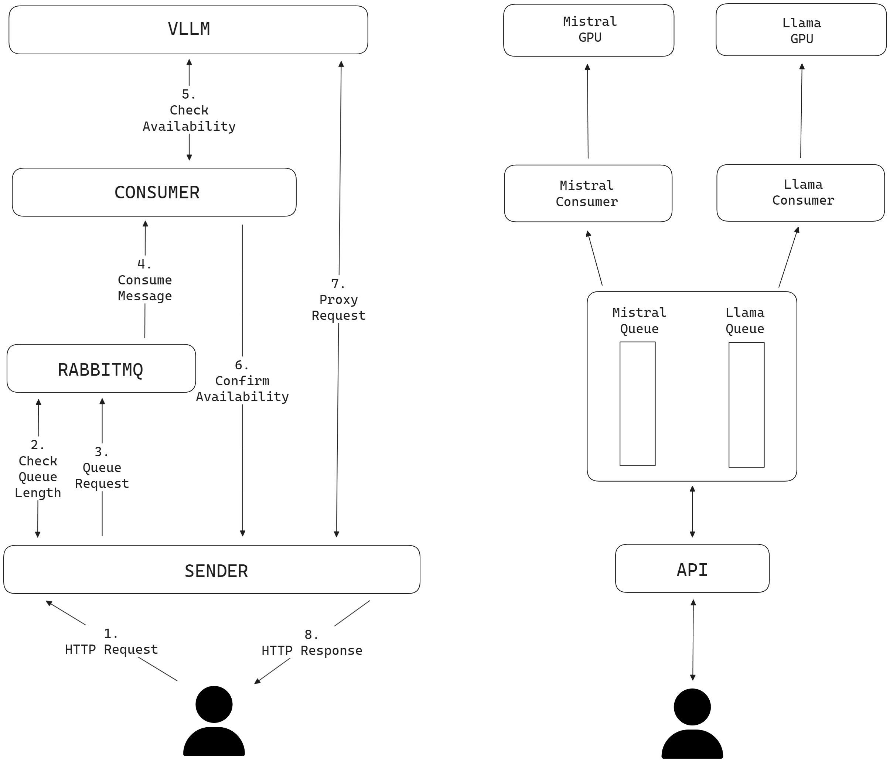

# Helm chart for large scale LLM

Deployement of LLM at a large scale using VLL server for inference.

## Introduction

This project originates in the need to optimize the use of GPUs by providing a way to use the same LLM for several concurrent uses and prioritize the most important ones. The prioritization uses a token-based authentication system, where each token has a priority level.

## Architecture

There are several possible architectures, but two fundamental criteria made us choose this one:
- Open AI standards must be respected, so that the system is completely transparent to the customer.
- No need to re-implement the Open AI API by hand, and no need to maintain it. The LLM has to respond to errors, and all we do is transfer them.

To respect this requirements, we divided the the project into three main components:
- The sender exposes an API to send tasks to the queue. It is responsible for checking the token and sending the task to the right queue (one queue per model), with the right priority.
- A RabbitMQ server is responsible for managing queues and the prioritization of the tasks.
- The consumer keeps track of the use of the model and pulls the tasks off the model queue when ready.

To improve performances, instead of having the consumer sending tasks to the LLM, it sends back to the sender an authorization to access the LLM directly. This way, the consumer can keep track of the use of the LLM and the sender can send the task directly to the LLM and act as a proxy for the consumer.



Let's dive into the steps shown above:

1. A user makes a request to the API as if it was a regular LLM following Open AI's standards.
2. The API use a bearer token to authenticate the user and retrieve its priority and threshold.
   - POST requests: Provide a `model` attribute in a JSON Body, therefore we can check the number of messages in the queue for this model and accept or deny the request of the user.
   - GET requests: No body and we must reimplement the behaviour of the desired route. For the endpoint `/v1/models`, we list all the models behind our queues (accordingly to the Open AI standard so it is possible to use OpenWebUI Interface).
3. If accepted, the request will be pushed into the right queue with its priority. The API makes a RPC call and wait for a response in a callback queue which will specify the LLM address available to handle the request.
4. There's a consumer for each LLM on each GPU. At its startup, it declares a queue corresponding to its model and consumes messages from it.
5. Before consuming each message, it checks the average throughput of token per user of the LLM and consume it only if it is greater than a certain value to ensure a pleasant use.
6. It then confirms to the API that the LLM can handle the request and send in the confirmation message the LLM's address.
7. The API has forwarded the request directly to the LLM.
8. The sender finally sends a response to the user.

## Configuration

In this section, we detail all the environment variables you can set to configure the sender and the consumer, the required and optional ones and their default value. You can configure these variables using Helm Chart (more information in the `README.md` at the root of this repository).

## Prerequisites

- [GPU Operator](https://docs.nvidia.com/datacenter/cloud-native/gpu-operator/latest/getting-started.html) from Nvidia should be installed in order to access the GPUs
- [RabbitMQ Operator](https://www.rabbitmq.com/kubernetes/operator/install-operator) should be installed if using the internal RabbitMQ cluster (values for the cluster are in rabbitmq-cluster.yaml)
- [ingress-nginx](https://docs.nginx.com/nginx-ingress-controller/installation/) for the ingress

External chart : 
- MySQL/PostgreSQL chart to have a database for identification tokens

## Values

Description of all parameters override.

### Models

List of all the models to deploy in the application.

| Name                   | Description                                                           | Value                                                   |
|------------------------|-----------------------------------------------------------------------|---------------------------------------------------------|
| `name`                 | Name for the model in the cluster. Use Kebab case                     | `""`                                                    |
| `model`                | Model name from HuggingFace                                           | `""`                                                    |
| `quantization`         | Quantization alogrithm of the used model                              | `""`                                                    |
| `dtype`                | Dtype of the model                                                    | `""`                                                    |
| `gpuMemoryUtilisation` | Maximum GPU memory usage                                              | `0.90`                                                  |
| `huggingface_token`    | Token used for pulling models from huggingface                        | `""`                                                    |
| `replicaCount`         | Replica count for the model                                           | `1`                                                     |
| `ropeScaling`          | Object representing RoPE scaling configuration to apply for the model | `{enabled: false, jsonConfiguration: "{}", theta: ""}`  |
| `pvc.enabled`          | Store model in a PVC to allow vllm to restart faster                  | `false`                                                 |
| `pvc.storageSize`      | Choose the size of the PVC if enabled. Should fit model size          | `"16Gi"`                                                |

`jsonConfiguration` and `theta` parameters of the `ropeScaling` configuration correspond to `--rope-scaling` and
`--rope-theta` arguments of the [vLLM engine](https://docs.vllm.ai/en/latest/models/engine_args.html).

### Tokens

This should be a list of all the tokens wanted and their respective priority.
The highest priority is the first one to be answered. It's their weight rather than their order. 

This is mandatory for an internal database, as it will be used to set up the database. If you are using an external database, you can fill it by yourself.

| Name         | Description                                          | Value |
|--------------|------------------------------------------------------|-------|
| `token`      | String for the token                                 | `""`  |
| `priority`   | Priority of the token                                | `1`   |
| `threshold`  | Maximum number of request in the queue for the token | `10`  |

### Sender

The sender is the Python block which reproduces the API and sends the message down to RabbitMQ.

| Name                         | Description                                                                             | Value                                        |
|------------------------------|-----------------------------------------------------------------------------------------|----------------------------------------------|
| `sender.image.repository`    | Repository of the image                                                                 | `centralesupelec/aristote-dispatcher-sender` |
| `seneder.image.pullPolicy`   | Pull policy of the image                                                                | `IfNotPresent`                               |
| `sender.image.tag`           | Tag of the image                                                                        | `latest`                                     |
| `sender.port`                | Port used by the sender                                                                 | `8080`                                       |
| `sender.resources`           | Resources specified for the container                                                   | `""`                                         |
| `sender.replicaCount`        | Replica count for the sender                                                            | `1`                                          |
| `sender.logLevel`            | Log level for the container (Debug: 10; Info: 20; Warn: 30, Error: 40; Fatal: 50)       | `"20"`                                       |
| `sender.env`                 | Environment variables to add to the container                                           | `[]`                                         |
| `sender.podAnnotations`      | Pod annotations for the sender                                                          | `{}`                                         |
| `sender.podSecurityContext`  | Security context for the pod                                                            | `{}`                                         |
| `sender.securityContext`     | Security context for the container                                                      | `{}`                                         |
| `sender.tolerations`         | Tolerations for the container                                                           | `[]`                                         |
| `sender.affinty`             | Node affinity and pod affinity for the pod: useful to separate CPU and GPU for example  | `{}`                                         |
| `sender.nodeSelector`        | Node selector for the pod                                                               | `{}`                                         |
| `sender.rpcReconnectAttempts`| Number of attemps to reconnect to RPC channel before setting pod to unhealthy           | `10`                                         |


### Consumer

The consumer is the Python block which pulls messages from the RabbitMQ queue and sends them to the inference server.

| Name                           | Description                                                                                   | Value                                          |
|--------------------------------|-----------------------------------------------------------------------------------------------|------------------------------------------------|
| `consumer.image.repository`    | Repository of the image                                                                       | `centralesupelec/aristote-dispatcher-consumer` |
| `consumer.image.pullPolicy`    | Pull policy of the image                                                                      | `IfNotPresent`                                 |
| `consumer.image.tag`           | Tag of the image                                                                              | `latest`                                       |
| `consumer.port`                | Port used by the consumer                                                                     | `8080`                                         |
| `consumer.resources`           | Resources specified for the container                                                         | `""`                                           |
| `consumer.replicaCount`        | Replica count for the consumer                                                                | `1`                                            |
| `consumer.env`                 | Environment variables to add to the container                                                 | `[]`                                           |
| `consumer.podAnnotations`      | Pod annotations for the sender                                                                | `{}`                                           |
| `consumer.podSecurityContext`  | Security context for the pod                                                                  | `{}`                                           |
| `consumer.securityContext`     | Security context for the container                                                            | `{}`                                           |
| `consumer.tolerations`         | Tolerations for the container                                                                 | `[]`                                           |
| `consumer.affinty`             | Node affinity and pod afinity for the pod: useful to separate CPU and GPU for example         | `{}`                                           |
| `consumer.nodeSelector`        | Node selector for the pod                                                                     | `{}`                                           |
| `consumer.rpcReconnectAttempts`| Number of attemps to reconnect to RPC channel before setting pod to unhealthy                 | `10`                                           |
| `consumer.rpcQueueExpiration`  | Number of milliseconds to wait before removing queue in RabbitMQ if consumer doesn't respond  | `30000`                                        |
| `consumer.probe.enabled`       | The pod uses routes to communicate its status to Kubernetes                                   | `true`                                         |
| `consumer.probe.port`          | Port used for probes (if probes are enabled)                                                  | `8081`                                         |


### Inference server

The inference server is using the GPU for infering on the LLM. We are using the vLLM inference server.

| Name                               | Description                                                   | Value              |
|------------------------------------|---------------------------------------------------------------|--------------------|
| `inferenceserver.image.repository` | Repository for the image                                      | `vllm/vllm-openai` |
| `inferenceserver.image.pullPolicy` | Pull policy for the image                                     | `IfNotPresent`     |
| `inferenceserver.image.tag`        | Tag for the image                                             | `latest`           |
| `inferenceserver.port`             | Port used by the inference server                             | `8000`             |
| `inferenceserver.resources`        | Resources specified for the container. Specifiy the GPU count | `""`               |
| `inferenceserver.replicaCount`     | Replica count for the inference server                        | `1`                |
| `inferenceserver.env`              | Environment variables to add to the container                 | `[]`               |
| `inferenceserver.monitoring`       | Monitor vLLM using Prometheus                                 | `False`            |


### RabbitMQ

RabbitMQ is used as a priority the queue system as well as an intermediary between sender and consumer. We are using the RabbitMQ cluster operator to create the cluster. The file is ```rabbitmq.yaml```. It is also compatible with an external RabbitMQ cluster.

| Name                     | Description                                                  | Value  |
|--------------------------|--------------------------------------------------------------|--------|
| `rabbitmq.internal`      | Use an internal RabbitMQ cluster                             | `True` |
| `rabbitmq.auth.user`     | Username for RabbitMQ (if external)                          | `""`   |
| `rabbitmq.auth.password` | Password for RabbitMQ (if external)                          | `""`   |
| `rabbitmq.host`          | Host for external RabbitMQ cluster                           | `""`   |
| `rabbitmq.monitoring`    | Monitor RabbitMQ using Prometheus (if internal)              | `False`|

### Database

Database used by the sender to store authentication tokens.

| Name                              | Description                            | Value                 |
|-----------------------------------|----------------------------------------|-----------------------|
| `database.internal`               | Use an internal database               | `True`                |
| `database.type`                   | Type of database: mysql or postgresql  | `mysql`               |
| `database.auth.rootPassword`      | Root password for the database         | `root`                |
| `database.auth.username`          | Username for the database              | `user`                |
| `database.auth.password`          | Password for the database              | `password`            |
| `database.auth.database`          | Database name                          | `test`                |
| `database.host`                   | Host for the database (if external)    | `""`                  |
| `database.initdbScriptsConfigMap` | init script for database (if internal) | `database-config-map` |


### Ingress

[Nginx ingress template](https://github.com/kubernetes/ingress-nginx/blob/main/charts/ingress-nginx/values.yaml).

## License

This project is licensed under the MIT License - see the [LICENSE](LICENSE) file for details.
