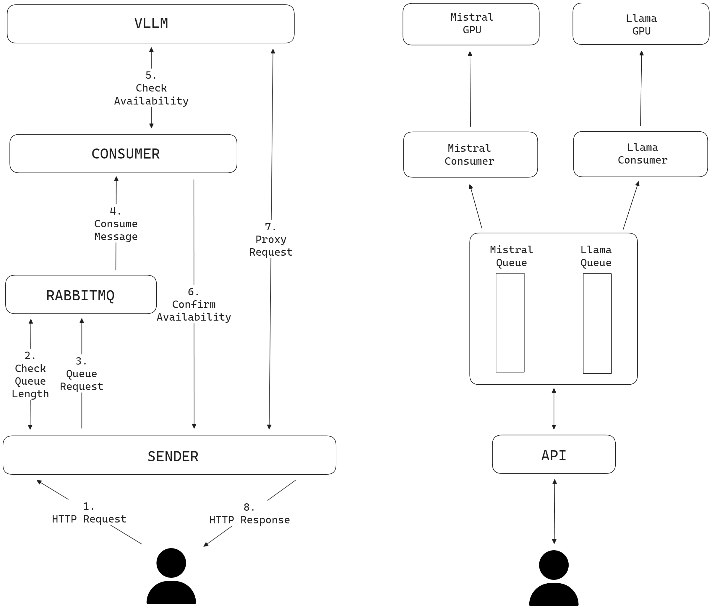

---
hide:
  - toc
---

## Aristote Dispatcher

Aristote Dispatcher permet :

- le déploiement à grande échelle de LLM,
- l'optimisation de l'utilisation de vos GPUs,
- la priorisation des tâches importantes.

En bref, avec Aristote Dispatcher :

- vous garantissez que vos GPUs sont avant tout utilisés pour leurs tâches principales
- vous leur permettez de travailler sur des tâches secondaires,
- vous assurez à l'utilisateur une API transparente suivant les standards Open AI.

Aristote Dispatcher est utilisé en production à [CentraleSupélec](https://www.centralesupelec.fr) depuis 2024 pour permettre l'utilisation de GPUs sur des LLM lorsqu'il ne sont pas utilisés par [Aristote](https://www.centralesupelec.fr/fr/aristote-une-ia-au-service-de-lenseignement-superieur).

### Architecture

<figure markdown>
  { width="750" }
  <figcaption>Architecture d'Aristote Dispatcher</figcaption>
</figure>

Son architecture permet de passer à l'échelle en fonction de la demande, des besoins et du nombre de GPUs disponibles.

Sa modularité permet un monitoring précis des différents composants en utilisant Prometheus et une résolution simple de la majorité des problèmes : [troubleshooting](/aristote-dispatcher/troubleshooting/)

### Confidentialité

Enfin, Aristote Dispatcher est respectueux des données des utilisateurs puisque vous conservez en permanence la maîtrise des données qui y transitent.

[Accès au code source](https://github.com/CentraleSupelec/aristote-dispatcher){ .md-button }
[Contactez-nous](mailto:contact.opensource@centralesupelec.fr){ .md-button }
