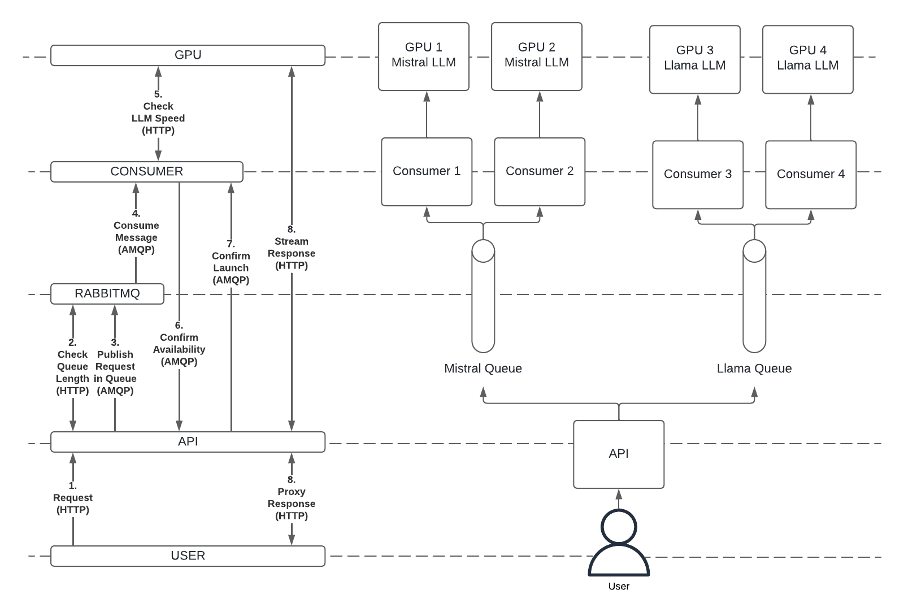

# Aristote Prioritizer, an open-source prioritizer for LLM inference

## Table of Contents

- [Introduction](#introduction)
- [Architecture](#architecture)
- [Configuration](#configuration)
- [Installation](#installation)
- [Development](#development)
- [License](#license)

## Introduction

This project originates in the need to optimize the use of GPUs by providing a way to use the same LLM for several concurrent uses and prioritize the most important ones. The prioritization is based on a token-based authentication system, where each token has a priority level.

## Architecture

Several architectures are possibles but we had two criteria that explain why we designed it that way:

- We want a system that is transparent for the client, as if he was asking a regular LLM following the Open AI standards.
- We don't want to re-implement the whole OpenAI API and have to maintain it. For instance, we want that the LLM responds to his own errors and we just "forward" the response.

To respect this requirements, we divided the the project into three main components:

- The sender, that exposes an API to send tasks to the queue. It is responsible for checking the token and sending the task to the right queue (one queue per model), with the right priority.
- A rabbitmq server, that is responsible for managing the queues (one for each model of LLM) and the prioritization of the tasks.
- The consumer, one per GPU and per LLM deployed, that keeps track of the use of the model and pulls the tasks off the model queue when ready.

To improve the performance of the system, instead having the consumer sending the tasks to the LLM, it sends back to the sender an authorization to access the LLM directly. This way, the consumer can keep track of the use of the LLM and the sender can send the task directly to the LLM and proxy it to the consumer.

A schema of the architecture can be seen below:



Let's deep into the steps shown above.

1. First a user makes a request to the API as it was a regular LLM behind that follows the standard of OpenAI.
2. The API use a bearer token to authenticate the user and retieve two properties : priority and threshold.
   - If it is a POST request, according to the Open AI standard, it must provide a `model` attribute in the JSON Body, therefore we can use it to check th number of message in the queue for this model and accept or deny the request of the user.
   - It it is a GET request, there is no body and we must reimplement the behaviour of the desired route. For instance, for the endpoint `/v1/models`, we list all the models behind our queues (accordingly to the Open AI standard so you can use a OpenWebUI Interface).
3. If accepted, the request will be pushed into the right queue with its priority properly set. In fact, the API makes a RPC Call and wait for a response in a callback queue which will specify the LLM address available to handle the request.
4. For each LLM on each GPU, we have a consumer in front. At its startup, it declares a queue with the name and the routing key set to its model's name and consume messages from this queue.
5. Before consuming each message, it checks the average throughput of token per user of the LLM and consume it only if it is greater than a certain value to ensure a pleasant use.
6. It then confirms to the API that the LLM can handle the request and send in the confirmation message the LLM's address.
7. The API confirms back to the consumer the reception of the address and the beginning of the request (step 8) so the consumer can consume a new message. This step is required because the metrics of the LLM are updated when a new request is send to it so we don't want to consume a new message before the API starts the request.
8. The API has started the request directly to the LLM and now proxy it to the client who just have the impression that he used a regular LLM.

## Configuration

In this section, we detail all the environment variables you can set to configure the sender and the consumer, the required and optional ones and their default value. You can configure these variables using Helm Chart (more information in the `README.md` at the root of this repository).

### Sender

- RABBITMQ_USER (str, default="guest")

- RABBITMQ_PASSOWRD (str, default="guest")

- RABBITMQ_HOST (str, default="localhost")

- RABBITMQ_PORT (int, default=5672)

- RABBITMQ_MANAGEMENT_PORT (int, default=15672)
- DB_TYPE (str, default="mysql"): set to "postgresql" or "mysql" if based on what database you want to use.

- DB_HOST (str, required)

- DB_USER (str, required)

- DB_PASSWORD (str, required)

- DB_DATABASE (str, required)

- DB_PORT (int, optional): default = 3306 if DB_TYPE is "mysql" or 5432 if DB_TYPE is "postgresql"

- RPC_RECONNECT_ATTEMPTS (int, default="10"): Number of attempts to reconnect to RPC before setting channel to unhealthy.

### Consumer

- MODEL (str, required): The LLM's model name that goes with this container.

- AVG_TOKEN_THRESHOLD (int, default=7): The minimum of average token throughput per user to allow to consume a new message. The default value of 7 ensure a pleasant use.

- NB_USER_THRESHOLD (int, default=10): When the LLM goes from no user to many users, the average token throughput metric delivered by the LLM is smoothed and unaccurate. To allow a quick start, we don't check the token throughput for the first users.

- RABBITMQ_USER (str, default="guest")

- RABBITMQ_PASSOWRD (str, default="guest")

- RABBITMQ_HOST (str, default="localhost")

- RABBITMQ_PORT (int, default=5672)

- POD_NAME (str, default="localhost"):

- SERVICE_NAME (str, default=""):

- TARGET_PORT (int, default=8080):

- LLM_URL (str, optional): When deployed in a Kubernetes cluster, you should not set it and let the program construct it with POD_NAME, SERVICE_NAME and TARGET_PORT. To test locally, use it to overwrite the address of the LLM.

- RPC_RECONNECT_ATTEMPTS (int, default="10"): Number of attempts to reconnect to RPC before setting channel to unhealthy.

- USE_PROBES (int {0, 1}, default="0"): Use specific routes to communicate health state with Kubernetes.

## Installation

This system is designed to run on Kubernetes, therefore a Helm chart is provided to install the system. To install the system, you need to have a Kubernetes cluster running and Helm installed. See Installation.md for more information.

## Development

To test the project locally, you need to have docker and docker-compose installed.

First, change the init_db files to put the right tokens and priorities. Example files are provided for both mysql and postgresql.

Then, you can run the following command:

```bash
docker compose up --build
```

You need to have a model running at localhost:50000 (the port and the host are customizable) or at least any kind of service that can be used to test the system.

## License

This project is licensed under the MIT License - see the [LICENSE](LICENSE) file for details.
